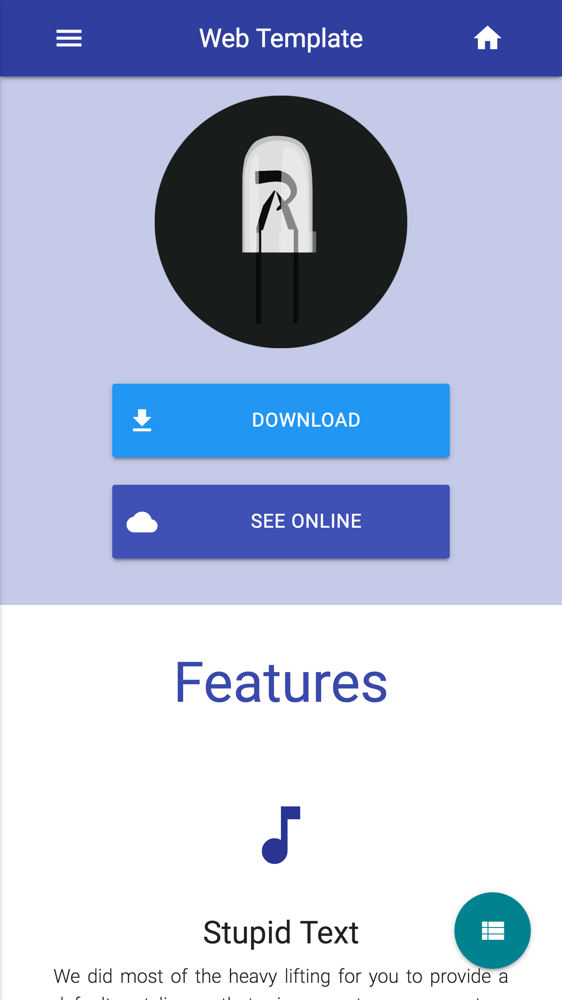
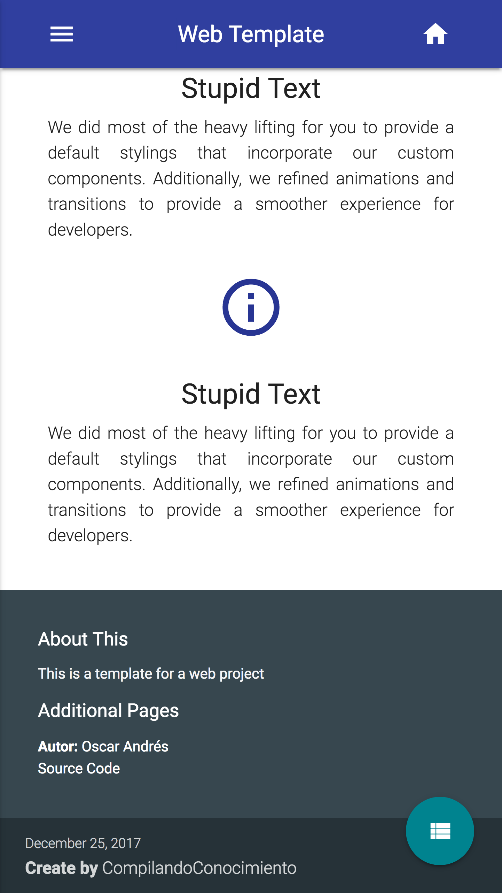
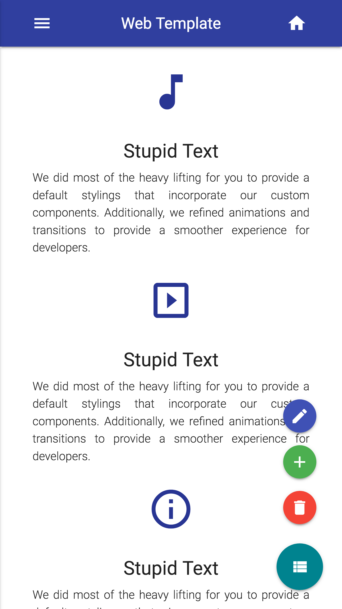
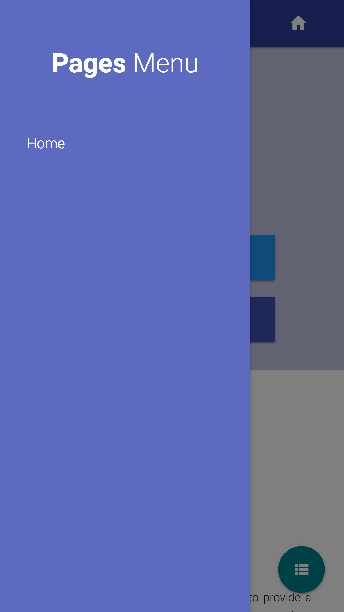

# Web Template Using MaterializeCSS

This is a UNFINISHED template for mini project for a webapp using MaterializeCSS

   

## Getting Started

You are free to use this code for anything you want, for get you a copy of the project
up and running on your local machine you just need to have a web server active with PHP.

### Built With

* [MaterializeCSS](http://materializecss.com/) - The web framework n.n (is amazing)
* [jQuery](https://jquery.com/) - Come on, I will not use raw Javascript

### Authors

* [SoyOscarRH](https://github.com/SoyOscarRH) - Oscar Andrés Rosas Hernandez

### License

This project is licensed under the GNU V2 License - see the [LICENSE.md](LICENSE.md) file
for details

  

## Showcase

Here I will show you some screenshots of the more important parts of the webapp. See how cute this is n.n

